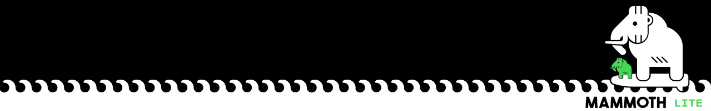

# 🦣 Mammoth Lite - A *liter* Framework for Continual Learning

Mammoth Lite is a lightweight and simplified version of the [Mammoth](https://github.com/aimagelab/mammoth) framework for continual learning research. This version prioritizes ease of use and minimal dependencies while maintaining the core functionality for developing and testing continual learning algorithms.

Mammoth Lite is designed for didactic purposes and to provide a simple and clean interface for experimenting with continual learning algorithms.  
It should not be used for academic research or development. For that, you should refer to the complete [Mammoth](https://github.com/aimagelab/mammoth).

<p align="center">
  
</p>

## ⚙️ Setup

- 📥 Install with `pip install -e .` or run directly with `python mammoth/main.py ...`
- 🚀 Use `mammoth/main.py` to run experiments
- 🧩 Models can be added to the `mammoth/models` folder
- 📊 Datasets can be added to the `mammoth/datasets` folder

## 🧪 Examples

### Running a model

To run a basic experiment:

```bash
python mammoth/main.py --model sgd --dataset seq-cifar10
```

You can customize various parameters:

```bash
python mammoth/main.py --model sgd --dataset seq-cifar10 --lr 0.01 --n_epochs 50
```

### Project Structure

- `mammoth/main.py`: Main entry point for running experiments
- `mammoth/models`: Contains continual learning models
- `mammoth/datasets`: Contains dataset implementations
- `mammoth/backbone`: Neural network architectures
- `mammoth/utils`: Utility functions and training code

## 🔧 Datasets

**NOTE**: Datasets are automatically downloaded in `mammoth/data/`.  
- This can be changed by modifying the `base_path` function in `mammoth/utils/conf.py` or using the `--base_path` argument.
- The `data/` folder should not be tracked by _git_ and is created automatically if missing.

Currently included datasets:
- Sequential CIFAR-10 (`seq-cifar10`): CIFAR-10 split into a sequence of tasks for Class-IL or Task-IL

## 📝 Citing

If you use Mammoth Lite in your research, please cite the original Mammoth papers:

```bibtex
@article{boschini2022class,
  title={Class-Incremental Continual Learning into the eXtended DER-verse},
  author={Boschini, Matteo and Bonicelli, Lorenzo and Buzzega, Pietro and Porrello, Angelo and Calderara, Simone},
  journal={IEEE Transactions on Pattern Analysis and Machine Intelligence},
  year={2022},
  publisher={IEEE}
}

@inproceedings{buzzega2020dark,
 author = {Buzzega, Pietro and Boschini, Matteo and Porrello, Angelo and Abati, Davide and Calderara, Simone},
 booktitle = {Advances in Neural Information Processing Systems},
 title = {Dark Experience for General Continual Learning: a Strong, Simple Baseline},
 volume = {33},
 year = {2020}
}
```
